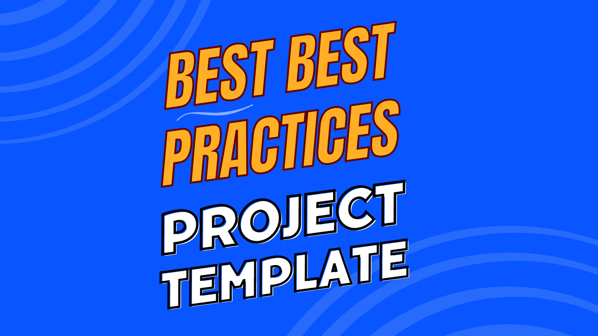
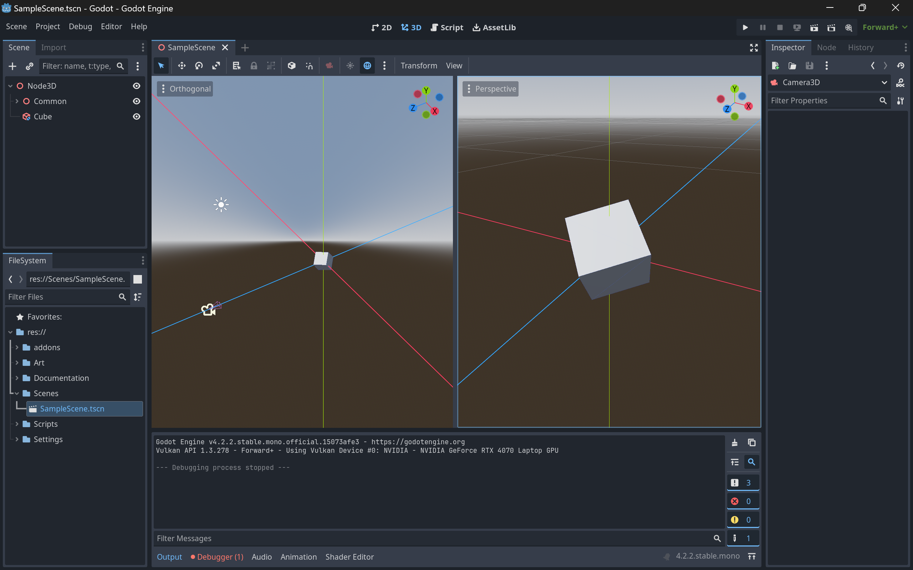

# Project Template - For Godot

This repo includes best practices for project structure and C# coding standards for the **Godot Engine**.

This is the ideal starting point for new Godot game projects.

 

**Highlights**

* **Does NOT require** any autoload, interface, nor baseclass. 
* **Compatible with** nodes, resources, and classes.
* **Compatible with** GDScript, C#, and C++

 
 

# Table of Contents

1. [Getting Started](#getting-started)
1. [Features](#features)
1. [Videos](#videos)
1. [Resources](#resources)
1. [Credits](#credits)

 
 

## Getting Started
1. Download this repo (*.zip or *.git)
1. Download the [Godot Engine](https://godotengine.org/)
1. Open the Godot Engine Editor
1. **Import** the `Godot` folder from this repo
1. Enjoy!

 
 

## Features

This project is a living template. It showcases the best practices and coding standards for many common workflows.

**Includes...**

* Git Repo - Folder structure, .gitignore, ReadMe.md
* Godot Project - Folder structure
* Scene Window - Node structure
* Runtime Scripting
* Editor Scripting 
* Unit Scripting 

 
 

## Videos

This **Godot Project** is featured in the following YouTube video playlist.

<table>
<tr>
<th>Best Practices - Game Dev (Godot Coming Soon)</th>
</tr>
<tr>
<td>

</td>
</tr>
</table>

 
 

## Resources

* Samuel Asher Rivello's <a href="https://www.samuelasherrivello.com/godot-portfolio/">Godot Portfolio</a> - Articles, Repos, & Tips
* Samuel Asher Rivello's <a href="https://sam-16930.medium.com/unity-project-structure-a694792cefed">Unity Article — Project Structure Best Practices</a> - Ideal setup
* Samuel Asher Rivello's <a href="https://sam-16930.medium.com/coding-standards-in-c-39aefee92db8">Unity Article — C# Coding Standards</a> - Naming, conventions, more!

 
 

## Credits

**Creator**

- Samuel Asher Rivello 
- Over 25 years XP with game development (2024)
- Over 11 years XP with Unity (2024)

**Contact**

- Twitter - <a href="https://twitter.com/srivello/">@srivello</a>
- Git - <a href="https://github.com/SamuelAsherRivello/">Github.com/SamuelAsherRivello</a>
- Resume & Portfolio - <a href="http://www.SamuelAsherRivello.com">SamuelAsherRivello.com</a>
- LinkedIn - <a href="https://Linkedin.com/in/SamuelAsherRivello">Linkedin.com/in/SamuelAsherRivello</a> <--- Say Hello! :)

**License**

Provided as-is under <a href="./LICENSE">MIT License</a> | Copyright ™ & © 2006 - 2024 Rivello Multimedia Consulting, LLC